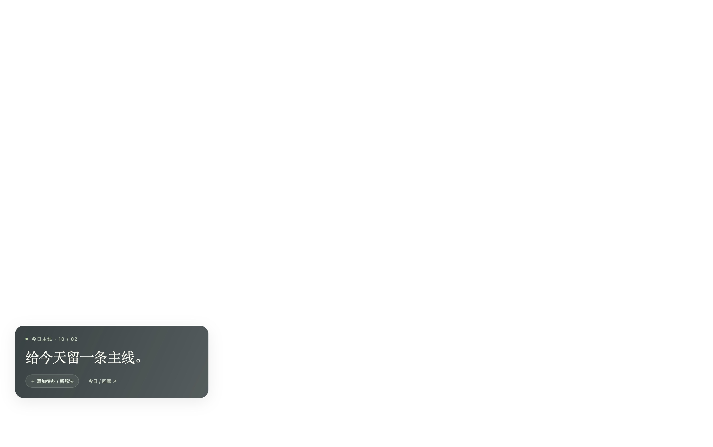

# One Thing

A quiet **Übersicht desktop widget** for choosing one concrete daily main task.
The desktop is the main interface: a small reminder, one optional secondary task, and an entry for putting new ideas into Queue.
A separate local web dashboard supports planning and daily history.



This captures the Übersicht window in isolation; its white backdrop is not the desktop wallpaper.

## Run the desktop widget

Requires Übersicht and Node.js 22 or newer.
From the repository root, start the widget's local data service:

```sh
npm ci
npm start
```

In Übersicht, choose **Open Widgets Folder**, copy this repository's `dashboard/` directory into it, and refresh the widget.
If Übersicht already uses this repository as its Widgets Folder, refresh it without copying another widget.
Only `dashboard/index.jsx` is discovered as a widget; the backend and supporting scripts live under ignored `src/` paths.
The installed JSX runs directly in Übersicht without a widget build step.
Keep the local data service running on its default port, 4317.

The task surface is click-through; the two entry buttons open Queue capture and the planning/history dashboard.
Übersicht requires its interaction shortcut and accessibility permission for clicks; configure these using its [official instructions](https://github.com/felixhageloh/uebersicht#running-shell-commands).
Follow [the desktop acceptance checklist](docs/architecture.md#desktop-check).

Your first day starts empty.
Use the Queue entry to record a task and choose today's primary task with a clear completion criterion.
The desktop then shows that task and refreshes from the same saved record every ten seconds.

## Planning and daily history

Open the widget's **今日 / 回顾** entry or [the local dashboard](http://127.0.0.1:4317).
The web page is the companion for organizing tasks and reviewing results.

1. Record a concrete task in Queue.
2. Choose it as today's main task and write a clear completion criterion.
3. Add one optional secondary task if there is room.
4. Mark the task complete in **今日主线**, then review the result in **每日回顾**.

Unfinished tasks return to Queue the next day without automatically becoming your new main task.
Completing the main task leaves that result visible for the rest of the day.
History distinguishes completed, unfinished, and unplanned days.

Records are saved in `.data/focus.json`, excluded from Git.
Use **导出记录** to download a backup.
The service listens only on localhost and uses the computer's timezone by default.
See [data, backup, and configuration](docs/architecture.md#data-and-validation).

## Review without changing your records

```sh
npm run demo
```

Open [the labeled sample dashboard](http://127.0.0.1:4318) or its [simulated desktop preview](http://127.0.0.1:4318/widget-preview).
These are browser review surfaces, separate from the installed desktop widget.
The demo uses disposable example records, separate from your own data.
Press Ctrl+C to stop it.

## Development and status

```sh
npm run check
```

This runs domain, persistence, HTTP integration, and widget discovery tests, plus JavaScript syntax and actual widget JSX compilation.

- [Current status and next steps](docs/status.md)
- [Documentation routes](docs/README.md)
- [Architecture and acceptance checks](docs/architecture.md)
- [Selected design and ten original concepts](docs/design-review.md)
- [Agent instructions](AGENTS.md)
