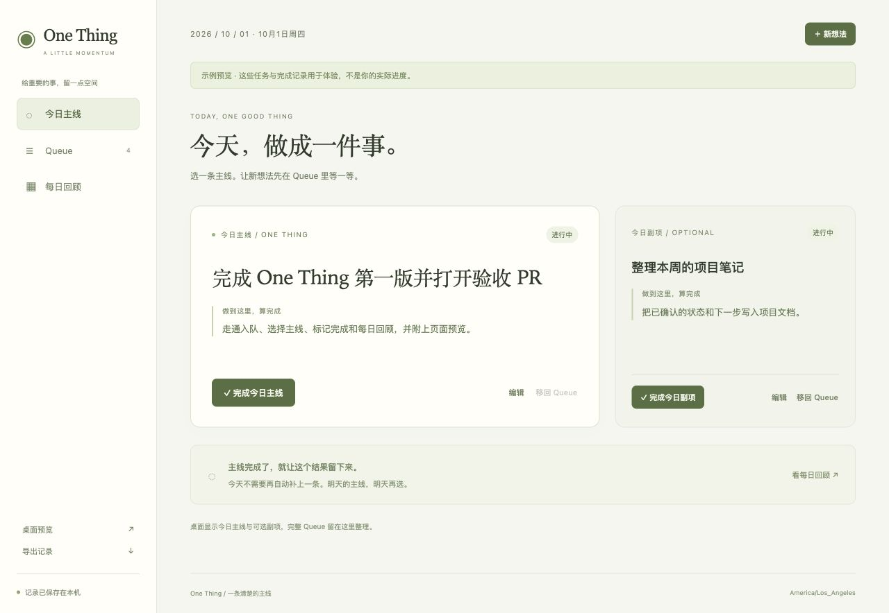

# One Thing

A quiet Übersicht desktop reminder and a local dashboard for choosing one concrete daily main task.
Capture new ideas in Queue, optionally arrange one secondary task, and keep a record of what you finished each day.
The desktop stays small; planning and history live in the dashboard.



## Try it

Requires Node.js 22 or newer.
From the repository root:

```sh
npm ci
npm run demo
```

Open [the sample dashboard](http://127.0.0.1:4318) or its [desktop preview](http://127.0.0.1:4318/widget-preview).
The demo is clearly labeled and uses disposable example records, separate from your own data.
Press Ctrl+C to stop it.

## Start your own daily record

```sh
npm start
```

Open [One Thing](http://127.0.0.1:4317), or run `npm run open` in another terminal.
Your first day starts empty.
The service must stay running while you use the dashboard or widget.

1. Record a concrete task in Queue.
2. Choose it as today's main task and write a clear completion criterion.
3. Add one optional secondary task if there is room.
4. Mark the task complete in **今日主线**, then review the result in **每日回顾**.

Unfinished tasks return to Queue the next day without automatically becoming your new main task.
Completing the main task leaves that result visible for the rest of the day.
The history distinguishes completed, unfinished, and unplanned days.

Records are saved in `.data/focus.json`, excluded from Git.
Use **导出记录** to download a backup.
The service listens only on localhost and uses the computer's timezone by default.
See [data, backup, and configuration](docs/architecture.md#data-and-validation).

## Add the desktop widget

Keep `npm start` running on its default port, 4317.
In Übersicht, choose **Open Widgets Folder**, copy this repository's `dashboard/` directory into it, and refresh the widget.
The installed JSX runs directly in Übersicht without a widget build step.

The task surface is click-through; the two entry buttons open Queue capture and the dashboard.
Übersicht requires its interaction shortcut and accessibility permission for clicks; configure these using its [official instructions](https://github.com/felixhageloh/uebersicht#running-shell-commands).
The browser desktop preview uses the actual widget JSX, but native installation, refresh, and click-through still need desktop acceptance.
Follow [the desktop checklist](docs/architecture.md#verification).

## Development and status

```sh
npm run check
```

This runs domain, persistence, and HTTP integration tests, plus JavaScript syntax and actual widget JSX compilation.

- [Current status and next steps](docs/status.md)
- [Documentation routes](docs/README.md)
- [Architecture and acceptance checks](docs/architecture.md)
- [Selected design and ten original concepts](docs/design-review.md)
- [Agent instructions](AGENTS.md)
